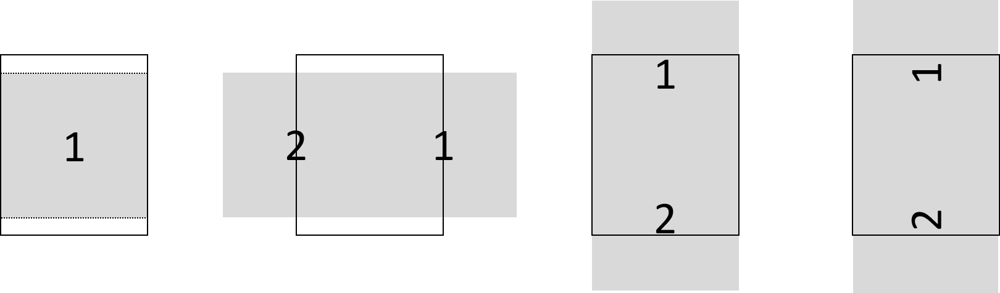

# 圖片瀏覽軟體

此軟體用於如漫畫、雜誌，一個主題下有很多集數，一集下有很多頁，以圖片為主的資料單位

開發語言: Java

使用者介面: Swing(Java)、Android6.0以上

測試影片: [Swing(Java)](https://www.youtube.com/watch?v=VORurSQo-2s)  |   [開放電子紙閱讀器](https://www.youtube.com/watch?v=cdyKz4VhWAA)

* [目錄](#圖片瀏覽軟體)

	* [軟體特色](#軟體特色)

	* [MVC架構-以SpringMVC為例](#MVC架構-以SpringMVC為例)

	* [簡化後的MVC架構](#簡化後的MVC架構)

	* [路徑層數](#路徑層數)

	* [視圖樣版](#視圖樣版)

		* [標籤排版](#標籤排版)
		
		* [圖片排版](#圖片排版)

	* [指令轉換器](#指令轉換器)

		* [螢幕相關互動](#螢幕相關互動)
		
		* [按鍵盤的互動](#按鍵盤的互動)

	* [設定檔MangaResouceIni](#設定檔MangaResouceIni)

	* [自動下載](#自動下載)
		
		* [背景下載優先順序](#背景下載優先順序)

	* [連接雲端](#連接雲端)

	* [函式庫安裝說明](#函式庫安裝說明)

	* [DAO層實作](#DAO層實作)

## 軟體特色

* 使用簡化版 **MVC架構**，在不使用javascript、jsp下，仍可以有基本的頁面操作能力

* 去除非必要的按鈕，盡可能放大資料圖片，並 **支援雙頁、半頁等排版** 方式

* 高度的客製化，只需修改設定檔，就可以實現不同的GUI互動效果

* 特殊的 **記數按鈕** 設計，可快速翻至指定頁，對電子紙閱讀器提供畫面上的友善

* 實作 **雲端DAO層**，資料可選擇存於本機或雲端

* 使用者閱讀時即 **自動部分下載** 雲端的資料，無須事前下載也不用擔心檔案過大

## MVC架構-以SpringMVC為例

以 網址 來選擇控制器以完成對應的服務

以 網址 區別不同的畫面和功能

以Google為例
```
mail.google.com/mail/   信箱服務
drive.google.com/drive/ 硬碟服務
drive.google.com/drive/u/0/folders/10wfZjfhkefvN45njV6 硬碟服務中某個資料夾
```


* 相關連結 	[Spring MVC Architecture](https://terasolunaorg.github.io/guideline/1.0.1.RELEASE/en/Overview/SpringMVCOverview.html)


--- --- --- --- --- --- --- --- --- --- --- ---

## 簡化後的MVC架構


使用同一個控制器

以 **路徑層數**和**圖片排版** 的組合來區別不同的畫面

簡化後的視圖樣版只顯示 **多個圖片 + 多個標籤**

## 路徑層數

**路徑層數** 分成三種
```
{本機/雲端}/image_id/image_ch_???/image_001.jpg

{本機/雲端}/image_id/image_ch_???/

{本機/雲端}/image_id/
```
分別對應 HolderEnum.java中enum 類別 Id, Ch, Pg

實際程式碼會去讀以下的圖片資料
```
{本機|雲端}/image_id/image_ch_???/image_001.jpg

{本機|雲端}/image_id/image_ch_???/{第一張圖片|最近讀取的圖片}

{本機|雲端}/image_id/{第一個資料夾|最近讀取的資料夾}/{第一張圖片|最近讀取的圖片}
```
檔案來源分成 **本機**和**雲端**

雲端資料會自動下載部分到本機端

來源檔格式如下
``` json
{
	"//": "該來源下的資料夾名稱",
	"kids": ["image_id_???", "image_id_???"], 
	"//": "0 表示本機端，其他表示雲端",
	"longs": [0,15786245]
}
```

## 視圖樣版

視圖樣版簡化成只顯示 **多個標籤 + 多個圖片**

> 圖片和標籤的位置資訊，會在顯示畫面取得 顯示物件的長寬後
> 
> 透由用 FrameInfor.java 的靜態方法計算取得
>
> 排版的選擇由 **MangaResouceIni.json 設定檔** 設定

#### 標籤排版

共有九種方式，分別是 四個角、四個邊和正中間，設定檔用0~8的數字表示
> 位置對應數字
> 
> 		0 1 2
> 
> 		3 8 4
> 
> 		5 6 7

#### 圖片排版 

共四種方式，對應 FrameEnum.java 中enum 類別 single, leftright, updown, dual

一張圖片，則盡可能放大至中；兩張圖片，則可以左右、上下放置，或旋轉並列



## 指令轉換器
由於此程式只有一個controller，不需要額外寫 網址分派器(DispatcherServlet)

相較傳統用javascript和html按鈕表單進行互動， 這裡用 java撰寫的指令轉換器取代

與使用者互動的方式簡化成三種，對應 MangaMain.java 中的方法 sendAPoint, sendASlide, sendACmd

```
點擊螢幕、滑動螢幕、按鍵盤
```

#### 螢幕相關互動

**指令轉換器**，會根據點擊螢幕的位置及滑動螢幕的方向，轉譯成不同的**指令**的程式碼

**指令** 的參數有三種， 當下點擊的次數、設定檔設定、預設參數

對應 CmdEnum.java 中enum 類別，如下
```
NextPage, To, Close ...

NextPage的參數是 點擊的次數，快速點擊N次，就會顯示N頁之後的內容

To的參數由設定檔給定，點擊會跳轉到指定的畫面

Close預設沒有參數，關閉軟體
```

#### 按鍵盤的互動

使用者會傳 鍵值(**行為**)，給 指令轉換器轉換成指令。

比方說，用 Backspace代表 上一頁(Back) **行為**，

透由不同的轉換器轉譯，可以是 跳轉(To) 到不同畫面(參數不同) 或 關閉(Close)。

**行為** 本身沒有參數，為抽象的概念，如 下一頁、到最後一頁、上一頁、進入、切換 ...

對應 CmdAbcE.java 中enum 類別，如下
```
NextPage, GoLast, Back, Enter, Switch ...
```

## 設定檔MangaResouceIni

不同的畫面( **路徑層數**和 **圖片排版** 的組合)，會有自己的指令轉換器，

可修改**MangaResouceIni.json**設定檔，執行時FrameM.java 會解析設定檔並產生獨自的指令轉換器

以下為部分設定檔內容，HolderEnum.Id 和 FrameEnum.single 的組合的畫面

``` json
{
  "Name": "IdSingle",
  "FrameType": "single",
  "HolderType": "Id",
  "LabelMs": [
	"//": "顯示在上邊，套用0號字型",
    [["__idName__"], 1, 0],
	"//": "顯示在下邊，套用0號字型",
    [["__page__", "-", "__len__"], 6, 0]
  ],
  "CmdMs": [
    {
	  "//": "在此CmdAbcE和CmdEnum都為NextPage，故只需定義CmdAbcE，省略Type",
      "CmdAbcE": "NextPage",
	  "//": "Range 定義點擊範圍",
      "Range": [0.0,0.0,0.33,0.4]
    },{
      "CmdAbcE": "PrevPage",
      "Range": [0.66,0.0,0.33,0.4]
    },{
      "CmdAbcE": "NextChapter",
      "Range": [0.0,0.4,0.33,0.4]
    },{
      "CmdAbcE": "Switch",
	  "//": "只有一個Type，代表按了即反應",
	  "//": "會忽略未執行的執行而直接執行此指令",
      "Type": "To",
      "Range": [0.33, 0.4, 0.33, 0.4],
      "Args": "IdDual"
    },{
      "CmdAbcE": "PrevChapter",
      "Range": [0.66,0.4,0.33,0.4]
    },{
      "CmdAbcE": "Back",
	  "//": "有多個Type，代表需要透由按的次數決定執行哪個指令",
	  "//": "按了一次，指令為 Nothing",
	  "//": "按了兩次以上，指令為 Close",
      "Type": ["Nothing","Close"],
      "Range": [0.0,0.8,0.25,0.2],
      "Args": ["",""]
    },{
      "CmdAbcE": "Enter",
      "Type": "To",
      "Range": [0.25,0.8,0.25,0.2],
      "Args": "ChSingle"
    },{
      "CmdAbcE": "Show",
      "Type": "Show",
      "Range": [0.75,0.8,0.25,0.2],
      "Args": "Setting01Single"
    }
  ],
  "SlideCmds": {
	"//": "分別對應，向上、向下、向左、向右",
    "CmdAbcE": ["NextPage","PrevPage","PrevPage","NextPage"],
    "Range": [0.33,0.0,0.33,0.4]
  }
}
```

## 自動下載

> 來源是雲端且本機端無法找到相同路徑的圖片時，程式會自動從雲端下載到本機端

自動下載分成 **直接** 和 **背景**

直接: 顯示當下還未下載，則程式會卡死直到圖片下載下來

背景: 程式會依據優先順序，預先下載部分的圖片

#### 背景下載優先順序

離目前顯示圖片愈近的圖片愈先被下載

即點擊 下一頁(NextPage)、上一頁(PrevPage)、下十頁(NextChapter)、上十頁(PrevChapter) 

到達某圖片所需的次數愈少，愈先被下載

這裡使用 [廣度優先Breadth-first wiki](https://zh.wikipedia.org/wiki/%E5%B9%BF%E5%BA%A6%E4%BC%98%E5%85%88%E6%90%9C%E7%B4%A2) 的方式優先下載完少次可到的圖片

至多下載的層數，thread pool的最大值，需在MangaResouceIni.json 設定檔中設定
``` json
{
	"NumThread": 2,
	"RangeNextPg": 4,
	"RangePrevPg": 4,
	"RangeNextCh": 2,
	"RangePrevCh": 2,
}
``` 
## 連接雲端
此程式碼連接的雲端為 [pCloud](https://www.pcloud.com/zh/eu)

選擇官網提供的 [OAuth 2.0驗證](https://zh.wikipedia.org/zh-tw/%E5%BC%80%E6%94%BE%E6%8E%88%E6%9D%83) 方式，使用 **HTTP/JSON 協定**傳送資料

1. 登入pCloud並建一個App

	到[pCloud: My applications](https://docs.pcloud.com/my_apps/) 申請App，
	
	Redirect URIs 填https://oauth2redirect
	
	Allow implicit grant需勾選Allow

	複製App 的 client_id，之後會使用

2. 取得token
	在瀏覽器輸入以下的網址(替換成自己的client_id)
	```
	https://my.pcloud.com/oauth2/authorize?client_id=??????&response_type=token&redirect_uri=https://oauth2redirect
	```
	登入驗證之後網頁會回傳
	```
	https://oauth2redirect/#access_token=??????&token_type=bearer&userid=??????&locationid=1&hostname=api.pcloud.com
	```
	這裡的access_token的值可用於存取雲端的資料
	
3. 測試程式碼 - 印出根目錄下的所有檔案名
	``` java
	ApiClient apiClient = PCloudSdk.newClientBuilder()
		.authenticator(Authenticators.newOAuthAuthenticator(<token>))
		// Other configuration...
		.create();
	try {
		long code = 0;
		List<RemoteEntry> entrys = apiClient.listFolder(code).execute().children();
		for(RemoteEntry entry: entrys) {
			System.out.println(entry.name());
		}	
	} catch (IOException | ApiError e) {
	}	
	```
* 參考來源 
	[pcloud-sdk-java github](https://github.com/pCloud/pcloud-sdk-java)
	[pcloud-sdk-swift github](https://github.com/pCloud/pcloud-sdk-swift) 
	[pCloud.authentication](https://docs.pcloud.com/methods/oauth_2.0/authorize.html) 
	[pCloud.docx](https://docs.pcloud.com/) 


## 函式庫安裝說明
要額外安裝json、pcloud api等外部程式碼

* Maven專案(Eclipse IDE)
	``` xml
	<dependency>
	  <groupId>com.pcloud.sdk</groupId>
	  <artifactId>java-core</artifactId>
	  <version>1.8.1</version>
	  <type>pom</type>
	</dependency>
	```
* Gradle專案(Android Studio)
	``` gradle
	implementation 'com.pcloud.sdk:java-core:1.8.1'
	```
* console
	需要下載
	
	converter-moshi.jar  moshi.jar  okio.jar gson.jar logging-interceptor.jar  okhttp.jar  retrofit.jar
	
	到 [pcloud-sdk-java github](https://github.com/pCloud/pcloud-sdk-java) 下載所提供的jar檔 java-core.jar

	所有的jar檔在工作目錄下需提取成class檔
	``` 
	jar xf *.java 
	``` 
* 參考來源 	[pcloud-sdk-java github](https://github.com/pCloud/pcloud-sdk-java)
	
## DAO層實作

在此程式碼中，只會從雲端查詢和下載資料，

故只在 [Data Access Object](https://zh.wikipedia.org/zh-tw/%E6%95%B0%E6%8D%AE%E8%AE%BF%E9%97%AE%E5%AF%B9%E8%B1%A1) 的模式中，中僅實作 get、getAll

CloudM.java 實作pCloud api的DAO層

程式碼中 TokenS為雲端資料夾資訊的物件 TokenUS為雲端檔案資訊的物件

透由 TokenS可以取得資料夾內包含那些檔案 TokenUS可以下載該檔案

``` java
public TokenS getTokenSFolder(Long node) throws SDEBase {
	List<List<KeyStringT<Infor>>> lists = getTokenS(node);
	Collections.sort(lists.get(0)); 
	return toTokenS(lists.get(0));
}
public TokenUS getTokenUSFile(Long node) throws SDEBase {
	List<List<KeyStringT<Infor>>> lists = getTokenS(node);
	Collections.sort(lists.get(1)); 
	return toTokenUS(lists.get(1));
}
``` 
